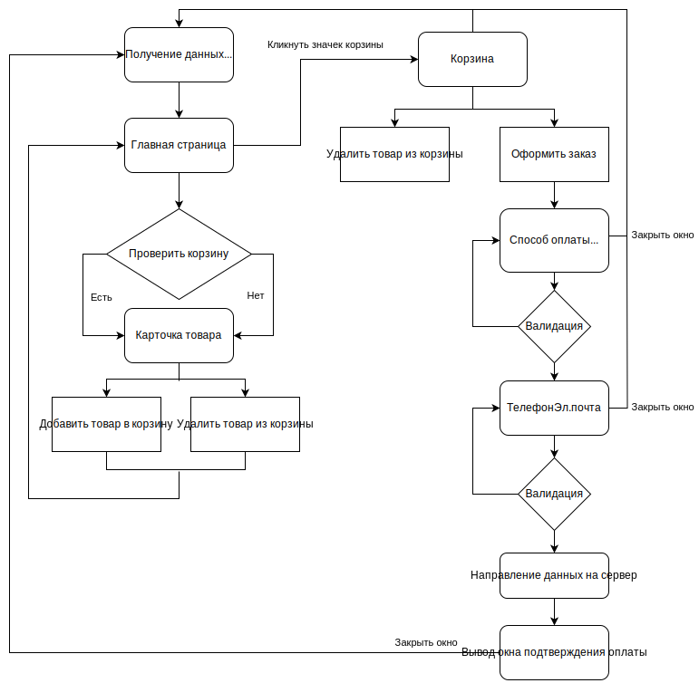

# Проектная работа "Веб-ларек"

_Интернет-магазин с товарами для веб-разработчиков — Web-ларёк. В магазине можно посмотреть каталог товаров, добавить товары в корзину и сделать заказ._

Стек: HTML, SCSS, TS, Webpack

Структура проекта:

- src/ — исходные файлы проекта
- src/components/ — папка с JS компонентами
- src/components/base/ — папка с базовым кодом

Важные файлы:

- src/pages/index.html — HTML-файл главной страницы
- src/types/index.ts — файл с типами
- src/index.ts — точка входа приложения
- src/styles/styles.scss — корневой файл стилей
- src/utils/constants.ts — файл с константами
- src/utils/utils.ts — файл с утилитами

## Установка и запуск

Для установки и запуска проекта необходимо выполнить команды

```bash
npm install
npm run start
```

или

```bash
yarn
yarn start
```

## Сборка

```bash
npm run build
```

или

```bash
yarn build
```

## Основные возможности

Главная страница содержит каталог товаров, предоставляет доступ к детальной информации о товаре и к корзине с выбранными товарами. При нажатии на кнопку «Купить» товар добавляется в корзину, если не был добавлен в корзину раньше, при нажатии на кнопку «Убрать» товар удаляется из корзины.

Оформление товара состоит из последовательного ввода информации в двух модальных окнах. В первом окне производится выбор способа оплаты и ввод адреса доставки. Если адрес доставки не введён, появляется сообщение об ошибке. Во втором окне осуществляется ввод почты и телефона покупателя. Если одно из полей не заполнено, также появляется сообщение об ошибке. При нажатии на кнопку оплаты появляется сообщение об успешной оплате и товары удаляются из корзины.

## Примененные паттерны

В проекте применен паттерн MVP (Model-View-Presenter), который обеспечивает четкое разделение ответственностей между компонентами приложения и улучшает его поддерживаемость и масштабируемость. Каждый компонент выполняет свою четко определенную роль:

- Модель (Model): Отвечает за работу с данными приложения.
  Классы и интерфейсы: `ISmallProductCard`, `IProductCard`, `IProduct`, `IPaymentInfo`, `IContactInfo`, `IOrder`, `IOrderFormError`.
- Представление (View): Отображает данные пользователю и взаимодействует с пользователем.
  Классы и интерфейсы: `ICard`, `IPage`.
- Представитель (Presenter): Связывает модель и представление, управляя взаимодействием между ними и логикой приложения. В роли презентера будет выступать код [основного скрипта](/src/index.ts) приложения.

## Архитектура приложения (бизнес логика)



## Архитектура слоя данных


## Базовый код

### Интерфейс `ISmallProductCard`

> Отвечает за хранение основной информации о продукте.

Свойства:

- `id: string` - уникальный идентификатор товара;
- `title: string` - название товара;
- `price: number | null` - цена товара.

### Интерфейс `IProductCard`

> Класс наследуется от интерфейса [`ISmallProductCard`](#интерфейс-ismallproductcard) и расширяет его свойства.

Свойства:

- `id: string` - уникальный идентификатор товара (наследуется от интерфейса [`ISmallProductCard`](#интерфейс-ismallproductcard));
- `title: string` - название товара (наследуется от интерфейса [`ISmallProductCard`](#интерфейс-ismallproductcard));
- `price: number | null` - цена товара (наследуется от интерфейса [`ISmallProductCard`](#интерфейс-ismallproductcard));
- `category: string` - категория товара;
- `imageUrl: string` - ссылка на изображение товара.

### Интерфейс `IProduct`

> Интерфейс наследуется от интерфейса [`IProductCard`](#интерфейс-iproduct) и расширяет его свойства. Отвечает за хранение полной информации о продукте.

Свойства:

- `id: string` - уникальный идентификатор товара (наследуется от интерфейса [`ISmallProductCard`](#интерфейс-ismallproductcard));
- `title: string` - название товара (наследуется от интерфейса [`ISmallProductCard`](#интерфейс-ismallproductcard));
- `price: number | null` - цена товара (наследуется от интерфейса [`ISmallProductCard`](#интерфейс-ismallproductcard));
- `category: string` - категория товара (наследуется от интерфейса [`IProductCard`](#интерфейс-iproductcard));
- `imageUrl: string` - ссылка на изображение товара (наследуется от интерфейса [`IProductCard`](#интерфейс-iproductcard));
- `description: string` - описание товара.

### Класс `Product`

> Класс имплементирует интерфейсы [`ISmallProductCard`](#интерфейс-ismallproductcard), [`IProductCard`](#интерфейс-iproductcard) и [`IProduct`](#интерфейс-iproduct). Отвечает за хранение полной информации о продукте.

### Интерфейс `IOrder`

> Отвечает за оформление заказа. Наследуется от интерфейсов [`IPaymentInfo`](#интерфейс-ipaymentinfo) и [`IContactInfo`](#интерфейс-icontactinfo).

Свойства:

- `id: string` - идентификатор заказа товаров;
- `total: number` - полная стоимость заказа;
- `items:`[`IProduct`](#интерфейс-iproduct)`[]` - коллекция товаров, включенных в заказ.
- `payment: payment` - способ оплаты заказа, где тип `payment` является ограничением из двух значений: `outline` и `upon delivery`. Наследуется от интерфейса [`IPaymentInfo`](#интерфейс-ipaymentinfo):

   ```typescript
   type payment = 'outline' | 'upon delivery';
   ```

- `email: string` - адрес электронной почты пользователя (наследуется от интерфейса [`IPaymentInfo`](#интерфейс-ipaymentinfo));
- `phone: string` - номер телефона пользователя (наследуется от интерфейса [`IContactInfo`](#интерфейс-icontactinfo));
- `address: string` - адрес доставки заказа (наследуется от интерфейса [`IContactInfo`](#интерфейс-icontactinfo)).

### Интерфейс `IPaymentInfo`

> Объединяет способ оплаты товара и адрес электронной почты. Является первым шагом в оформлении заказа.

Свойства:

- `payment: payment` - способ оплаты заказа, где тип payment является ограничением из двух значений: `outline` и `upon delivery`.

   ```typescript
   type payment = 'outline' | 'upon delivery';
   ```

- `email: string` - адрес электронной почты пользователя.

### Интерфейс `IContactInfo`

> Объединяет действие по вводу номера телефона и адреса доставки заказа. Является вторым шагом в оформлении заказа.

Свойства:

- `phone: string` - номер телефона пользователя;
- `address: string` - адрес доставки заказа.

### Класс `Order`

> Отвечает за оформление заказа. Имплементирует интерфейсы  [`IPaymentInfo`](#интерфейс-ipaymentinfo), [`IContactInfo`](#интерфейс-icontactinfo) и [`IOrder`](#интерфейс-iorder)

### Класс `EventEmitter`

> Брокер событий — это класс, позволяющий объектам подписываться на определённые типы событий и получать уведомления о них.

Функции:

- `on(eventName, callback)` - подписывается на определённый тип событий;
- `off(eventName, callback)` - отписывается от определённого типа событий;
- `emit(eventName, data)` - отправляет событие определённого типа;
- `onAll(callback)` - подписывается на все события;
- `offAll()` - отписывается от всех событий;
- `trigger(eventName, context)` - создаёт коллбек-триггер, который генерирует событие при вызове.

### Класс `Api`

> Класс `API` — класс, который позволяет отправлять запросы к API.

Методы:

- `getUri(uri: string)` — отправляет GET-запрос к указанному URI;
- `postUri(uri: string, data: object, method: ApiPostMethods = 'POST')` — отправляет POST-запрос к указанному URI (возможными вариантами могут быть `POST`, `PUT` или `DELETE`);
- `handleResponse()` - обрабатывает ответ сервера и возвращает объект в формате JSON.

### Интерфейс `IAppState`

> Интерфейс, отвечающий за бизнес-логику.

Свойства:

- `store: IProduct[]` - коллекция продуктов, представленных в ветрине приложения;
- `basket: ISmallProductCard[]` - коллекция продуктов, помещенных в заказ;

Функции:

- `getInitialStore(items: IProduct[]):void` - заполняет витрину приложения продуктами;
- `getProductInStore(id: string): IProduct` - получает продукт, размещенный в ветрине приложения, по его индексу;
- `addProductToBasket (value: ISmallProductCard): void` - добавляет продукт в заказ;
- `removeProductFromBasket (value: ISmallProductCard): void`- удаляет продукт из заказа;
- `existsProductInBasket(value: ISmallProductCard): boolean` - проверяет наличие продукта в заказе, используется для изменения надписи кнопки;
- `getTotalBasketPrice(): number` - получает общую стоимость заказа;
- `setPaymentInfo(payment: payment, address: string): void` - вносит в заказ способ оплаты и адрес доставки;
- `validatePaymentInfo(): boolean` - проверяет корректность указания способа оплаты и адреса доставки;
- `setContactsInfo(email: string, phone: string): void` - вносит в заказ сведения о контакте: адресе электронной почты и номере телефона);
- `validateContactsInfo(): boolean` - проверяет корректность внесения в заказ адреса электронной почты и номера телефона;
- `pay():void` - выполняет оплату товара и очищает содержимое заказа.

### Класс `AppData`

> Класс имплементирует интерфейс [`IAppState`](#интерфейс-iappstate) и отвечает за бизнес-логику приложения.

События:

- `store:changed` - вызывается при инициализации витрины продуктов;
- `basket:changed` - вызывается при изменении содержимого корзины;
- `payment:ready` - вызывается при реализации проверки корректности заполнения информации об оплате;
- `paymentFormErrors:change` - вызывается по результату проверки корректности заполнения информации об оплате;
- `contacts:ready` - вызывается при реализации проверки корректности заполнения контактных данных;
- `contactFormErrors:change` - вызывается по результату проверки коеектности заполнения контактных данных;
- `order:pay` - вызывается по результату оплаты товара.